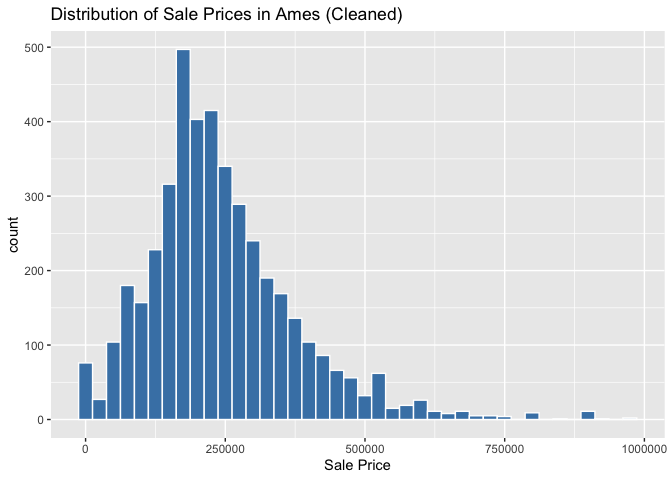

<!-- README.md is generated from README.Rmd. Please edit the README.Rmd file -->

# Lab report \#1

Follow the instructions posted at
<https://ds202-at-isu.github.io/labs.html> for the lab assignment. The
work is meant to be finished during the lab time, but you have time
until Monday evening to polish things.

Include your answers in this document (Rmd file). Make sure that it
knits properly (into the md file). Upload both the Rmd and the md file
to your repository.

All submissions to the github repo will be automatically uploaded for
grading once the due date is passed. Submit a link to your repository on
Canvas (only one submission per team) to signal to the instructors that
you are done with your submission. \## TL;DR

The Ames housing dataset shows that while raw sale prices include
extreme outliers, cleaning the data gives a realistic range of
\$1,100–\$975,000 with most homes selling between \$150K–\$300K. Prices
are right-skewed, as expected in housing markets. Total Living Area is
strongly and positively related to Sale Price—larger homes usually sell
for more—though outliers exist. Overall, living space stands out as one
of the strongest predictors of housing prices in Ames.

## Step 1 result

As a team, we found that the dataset contains detailed information about
residential property sales in Ames, Iowa since 2017. Each row is a
property sale record, and the variables describe the property, sale
details, and physical features. From the first few rows we see:

Parcel ID, Address: identifiers for the property.

Style: type of home construction (e.g., “1 Story Frame”, “2 Story
Frame”).

Occupancy: type of ownership (e.g., “Single-Family / Owner Occupied”,
“Condominium”, “Townhouse”).

Sale Date, Sale Price, Multi Sale: transaction details, including the
price (numeric, dollars), date, and whether multiple sales occurred.

YearBuilt: numeric year when the home was built.

Acres, LotArea(sf): lot size in acres and square feet (numeric,
continuous).

TotalLivingArea (sf), FinishedBsmtArea (sf): size of living space above
ground and finished basement area (numeric, continuous).

Bedrooms, AC, FirePlace: house features, including number of bedrooms
(numeric), central air conditioning (categorical Yes/No), and fireplace
(Yes/No).

Neighborhood: categorical variable for location within Ames.

##### Data types and expected ranges:

IDs and addresses are character/text.

Categorical variables: Style, Occupancy, AC, FirePlace, Neighborhood.

Numeric variables: Sale Price (expected \$0–\$600,000+), YearBuilt
(1800s–2020s), Acres (\< 1 to several), TotalLivingArea and LotArea
(hundreds to tens of thousands of square feet), Bedrooms (0–6+).

Dates are stored as proper date values (Sale Date).

## Step 2 result

``` r
summary(ames$`Sale Price`)
```

    ##     Min.  1st Qu.   Median     Mean  3rd Qu.     Max. 
    ##        0        0   170900  1017479   280000 20500000

``` r
ggplot(ames, aes(x = `Sale Price`)) + 
geom_histogram(bins = 40, fill = "steelblue", color = "white") +
labs(title = "Distribution of Sale Prices in Ames")
```

<!-- --> As a team, we
found that our main variable of interest is Sale Price. The summary
shows values ranging from 0 up to 20,500,000, with a median of about
\$170,900. While the median and quartiles are in a reasonable housing
range, the maximum is far above typical home prices, suggesting the
dataset contains extreme outliers or data entry errors. The histogram
also shows most homes clustered at the lower end, with just a few
unusual values stretching far to the right, creating a highly skewed
distribution.

## Step 3 result

``` r
ames_clean <- ames %>%
  filter(`Sale Price` > 1000, `Sale Price` < 1000000)

summary(ames_clean$`Sale Price`)
```

    ##    Min. 1st Qu.  Median    Mean 3rd Qu.    Max. 
    ##    1100  160700  222000  243869  307000  975000

``` r
ggplot(ames_clean, aes(x = `Sale Price`)) +
  geom_histogram(bins = 40, fill = "steelblue", color = "white") +
  labs(title = "Distribution of Sale Prices in Ames (Cleaned)")
```

<!-- -->

As a team, we found that the raw Sale Price variable contained
unrealistic values (such as 0 and prices over \$20 million). After
filtering out those outliers, the cleaned data showed a much more
reasonable range of prices, from \$1,100 to \$975,000, with a median
around \$222,000.

The histogram shows that most homes in Ames sell between \$150,000 and
\$300,000, with fewer homes at both the very low and very high ends. The
distribution is right-skewed, which is typical in housing data because
while most homes are moderately priced, a smaller number of expensive
homes extend the upper tail of the distribution.

## Step 4 result

##### Nhu’s work: Living Area vs. Sale Price

``` r
ggplot(ames_clean, aes(x = `TotalLivingArea (sf)`, y = `Sale Price`)) +
  geom_point(alpha = 0.4) +
  geom_smooth(method = "lm", color = "red") +
  labs(title = "Sale Price vs. Total Living Area",
       x = "Total Living Area (sq ft)",
       y = "Sale Price")
```

    ## Warning: Removed 329 rows containing non-finite outside the scale range
    ## (`stat_smooth()`).

    ## Warning: Removed 329 rows containing missing values or values outside the scale range
    ## (`geom_point()`).

<!-- -->

I explored how Total Living Area (sf) relates to Sale Price. The range
is approximately 0 – 6,000 sq ft. Most homes cluster under 3,000 sq ft,
with only a few very large houses above that. The scatterplot shows a
clear positive trend: larger homes generally sell for higher prices. The
regression line confirms this relationship.

At the same time, there are outliers in both directions: Some very large
houses sold for surprisingly low prices. Some smaller homes sold for
unusually high prices. These cases may be explained by other factors
like property condition, renovations, or desirable locations. This
confirms that living space is one of the strongest predictors of sale
price in Ames.

##### Deesha’s work: YearBuilt vs. Sale Price

``` r
ggplot(ames_clean, aes(x = `YearBuilt`, y = `Sale Price`)) +
  geom_point(alpha = 0.4) +
  geom_smooth(method = "lm", color = "blue") +
  labs(title = "Sale Price vs. Year Built",
       x = "Year Built",
       y = "Sale Price")
```

    ## Warning: Removed 329 rows containing non-finite outside the scale range
    ## (`stat_smooth()`).

    ## Warning: Removed 329 rows containing missing values or values outside the scale range
    ## (`geom_point()`).

<!-- -->

I explored how the year a house was built relates to its sale price. The
range of construction years spans from the early 1900s to the 2010s.
Most homes were built between 1950 and 2000, with fewer houses from very
early or very recent years. The scatterplot shows a general positive
trend: newer homes tend to sell for higher prices. The regression line
confirms this relationship.

At the same time, there are notable outliers: some older homes sold for
surprisingly high prices, possibly due to renovations, historical value,
or location. Likewise, some newer homes sold for lower-than-expected
prices, which could be influenced by factors like lot size, condition,
or neighborhood. This analysis confirms that the year built is a
meaningful predictor of sale price, though other factors also play an
important role.

##### Mahathi’s Work:

``` r
ggplot(ames_clean, aes(x = `LotArea(sf)`, y = `Sale Price`)) +
  geom_point(alpha = 0.4) +
  geom_smooth(method = "lm", color = "green") +
  labs(title = "Sale Price vs. Lot Area",
       x = "Lot Area (square feet)",
       y = "Sale Price")
```

    ## Warning: Removed 59 rows containing non-finite outside the scale range
    ## (`stat_smooth()`).

    ## Warning: Removed 59 rows containing missing values or values outside the scale range
    ## (`geom_point()`).

<!-- --> I looked at
the relationship between the lot area and the sale price of the house.
The average lot area is around 10,000 square foot and it sells between
\$250,000 and \$500,000. The scatterplot shows a slightly positive trend
for lot area and sale price. There are some outliers that have a small
lot area and a high sale price. This could be due to other factors like
a neighborhood being affluent or some other external benefit. At the
same time, there were other areas with large lot sizes that sold for
cheap. Potentially due to the being fixer uppers or in a poor
neighborhood.
